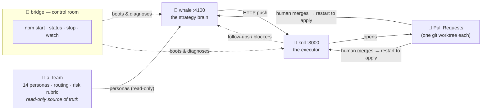
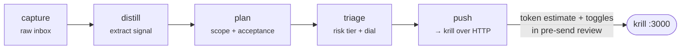
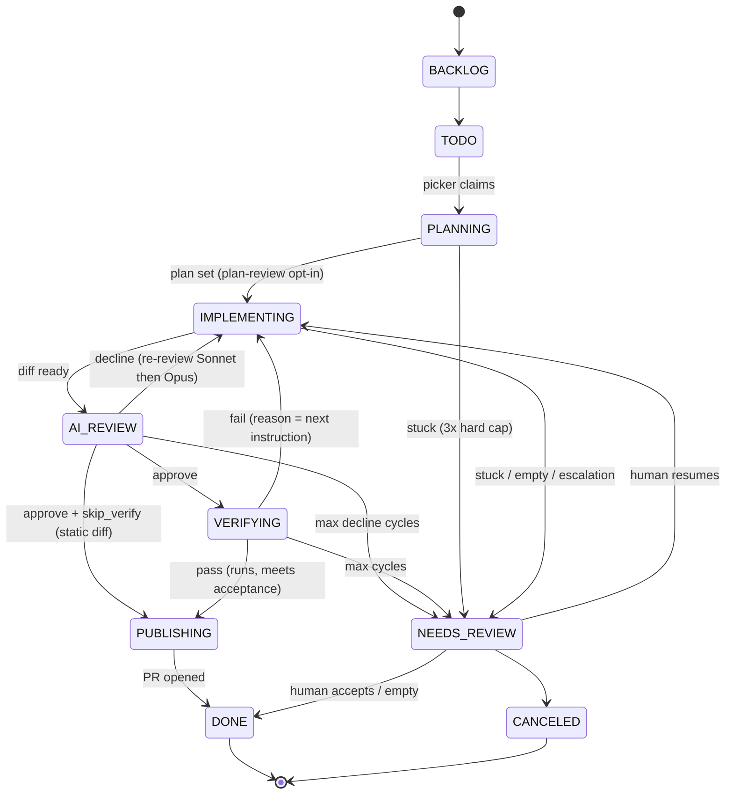
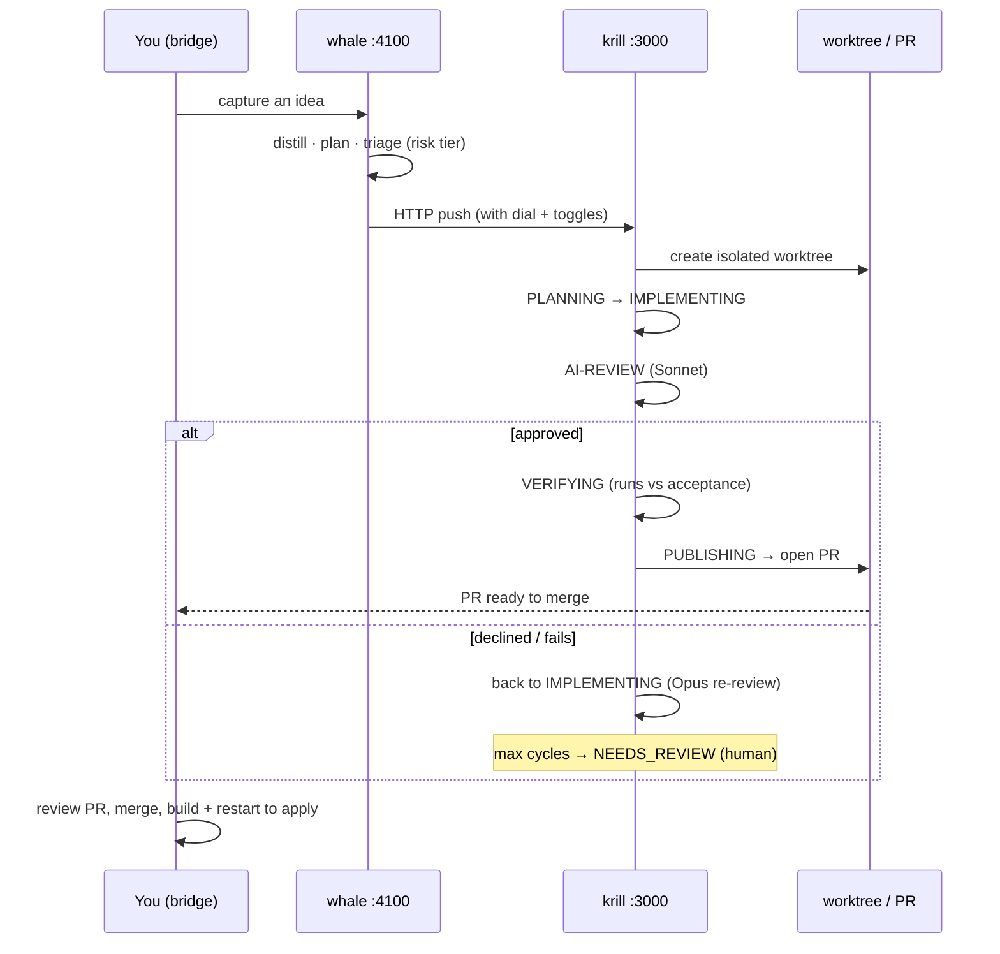

# The Fleet — how it works

A developer's map of the **AI-fleet**: three repos that turn a raw idea into a merged
pull-request with a human in the loop only where it matters. This is the prose+diagram
companion to the *"The Working Deep"* plate in this folder.

> TL;DR — **whale** is the brain (it thinks: capture → plan → push), **krill** is the
> hands (it builds: plan → implement → review → verify → PR), **ai-team** is the
> read-only knowledge it reasons with, and **bridge** is the control room you drive it all from.

---

## 1. Topology

One-way dependency: `ai-team ← whale → krill`. whale *reads* personas (never writes them)
and talks to krill over **HTTP only**. krill does the work in isolated git worktrees and
lands the result as a **pull-request** — the running processes keep old code until you restart.



| Repo | Path | Role | Port |
| --- | --- | --- | --- |
| **ai-team** | `../ai-team` | 14 AI personas + auto-routing + risk rubric. Read-only. | — |
| **whale** | `../whale` | Capture → distill → plan → triage → push. Decides *what* & *whether*. | 4100 |
| **krill** | `../krill` | Staged task pipeline that writes code → PR. Does *the work*. | 3000 |
| **bridge** | `.` (here) | Orchestrator/control room. Start, stop, diagnose, watch. | — |

Both apps run **real Claude** (spawn the Claude Code CLI — no API key): whale via
`WHALE_RUNNER=real`, krill via `CLAUDE_RUNNER=real`. Both serve a Next **production
build**, so a change is live only after **`npm run build` + restart**, not merge alone.

---

## 2. whale — the strategy brain (:4100)

whale turns raw capture into scoped, risk-triaged work and pushes it to krill. Its thinking
stages each have a deterministic offline stub and a real-Claude path.



At **push**, whale pre-flights a token estimate (sum of krill stage medians for the stages
this task will actually run) and honors the per-task toggles (plan-review, AI-review,
verify) chosen in the pre-send modal.

---

## 3. krill — the executor (:3000)

krill runs each task through a staged state machine. Every task runs in its **own git
worktree**; the terminal success state (`PUBLISHING`) opens a **PR**. The line **always
concludes** — no task loops or hangs forever.

Persisted statuses (`krill/src/db/schema.ts`):
`BACKLOG · TODO · PLANNING · IMPLEMENTING · AI-REVIEW · VERIFYING · PUBLISHING · NEEDS_REVIEW · DONE · CANCELED`



Key behaviors:
- **AI-review model ladder** — first AI-REVIEW runs **Sonnet**; once a decline cycle
  exists, re-reviews run **Opus**. `stage_usage.model` records what actually ran.
- **VERIFYING** reports whether the change *runs* and meets its **acceptance**
  (definition-of-done set at planning) — it does **not** fix code; a fail bounces back to
  IMPLEMENTING with the reason as the next instruction.
- **Escalation** — on a genuine judgment fork the agent parks the task (higher-effort
  decision pass, then a human) instead of guessing. Valid in planning/implementing/ai_review/verify.
- **Follow-ups** — out-of-scope work seeds a follow-up (a note whale ingests), comments
  the origin task, files a persistent warning, and **pauses the global picker** until a
  human clears it (Resume / Dismiss). In-flight tasks keep going.

---

## 4. A task's life, end to end



---

## 5. Autonomy dials

whale triages each task to a **risk tier** (🟢 low · 🟡 medium · 🔴 high), then the active
**dial** decides whether it auto-finishes, needs review, or bypasses gates. Source:
`whale/src/app/api/config/route.ts`, `whale/src/components/whale/whale-app.tsx`.

| Dial | 🟢 low | 🟡 medium | 🔴 high (migrations/auth/deploy) |
| --- | --- | --- | --- |
| `conservative` | review | review | review |
| `balanced` | bypass gate | review | review |
| `aggressive` | auto | bypass gate | review |
| `autonomous` | auto | auto | review |
| `ludicrous` | auto | auto | **auto** (merges to main unattended) |

**Self-edit is exempt from all of this.** Any task targeting `whale`/`krill` **never skips
planning and never auto-finishes** — the deliverable always gets a human review before
merge, on *every* dial including `ludicrous`.

---

## 6. Safety rails

- **Self-edit guard** — the fleet improves itself through this loop; a self-targeting task
  always plans and always ends at a human-reviewed deliverable. `../whale && npm test` is
  the merge gate.
- **Worktrees + PRs** — work lands as a PR; the live process runs old code until you
  restart. Roll back = git + restart.
- **Blocker queue** — hitting an interactive wall (MCP auth, CLI login) **pauses and files
  a blocker** instead of failing. Clear it to resume. (MCP-auth blockers carry no clickable
  link — authenticate the MCP once in a live `claude` → `/mcp` session; the headless runner
  reuses the cached token.)
- **Always-concludes backstops** — a stage past its duration limit notifies; past the
  **hard cap (3×)** the scanner force-parks it at `NEEDS_REVIEW(stuck)` and pauses the line.
- **Dead-worker recovery** — a restart orphans in-flight work (worker dies, claim
  outlives it); the stuck scanner auto-releases dead-process claims (~1 min, by boot
  generation) and re-picks. The board's **Recover** button is a manual override.
- **krill loads your user MCP** into the executor (e.g. Supabase) — an armed task can write
  external systems unattended. `KRILL_STRICT_MCP=1` isolates it.

---

## 7. Operate (from bridge)

```bash
npm start        # boot krill + whale (idempotent)
npm run status   # diagnose the whole fleet: runner mode, projects, inbox/proposed, personas
npm stop         # stop both by port
npm run watch    # follow the next new krill task to a terminal state (read-only)
npm run rebuild  # rebuild BOTH apps + restart the fleet
```

`npm stop` / `npm run rebuild` **refuse while the fleet is working** (a live krill claim or
in-flight whale job) — override with `-- --force`. Iterating on UI? Run an app in dev for
hot reload: `cd ../whale && npm run dev` (4100) or `cd ../krill && npm run dev` (3000).

---

*Facts sourced from `bridge/CLAUDE.md` (audited), `krill/src/db/schema.ts`,
`whale/src/lib/stages.ts`, and the whale dial config. Regenerate the plate with
`python3 gen.py`.*
